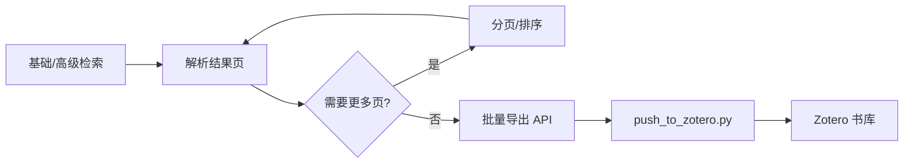
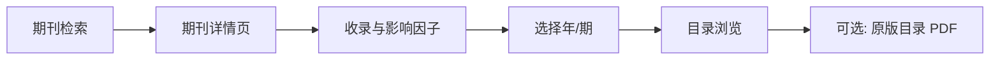

# CNKI Research Toolkit（中国知网综合工具）

面向 Cursor / Claude Agent 的 **中国知网（CNKI）文献研究 Skill**。将原先分散的 10 个子 Skill 合并为单一工作流，通过 **Chrome DevTools MCP** 在真实浏览器中完成检索、解析、下载、导出与期刊分析。

| 属性 | 说明 |
|------|------|
| Skill 名称 | `CNKI Research Toolkit` |
| 类型 | Agent Skill（`SKILL.md`） |
| 依赖 MCP | `chrome-devtools`（`navigate_page`、`evaluate_script`、`take_snapshot` 等） |
| 可选依赖 | Zotero 桌面版（本地 API `127.0.0.1:23119`）、`push_to_zotero.py` 脚本 |
| 许可与合规 | 需遵守知网用户协议；下载/导出通常要求机构或个人账号权限 |

---

## 功能概览

本 Skill 覆盖知网文献研究的完整链路，Agent 根据用户意图自动路由到对应模块：

| 用户意图 | 模块 | 典型工具调用数 |
|----------|------|----------------|
| 关键词检索论文 | 基础检索 | 2（导航 + 脚本） |
| 作者/期刊/年份/核心库筛选 | 高级检索 | 2 |
| 解析当前结果页列表 | 结果解析 | 1 |
| 翻页 / 排序 | 分页与排序 | 1 |
| 单篇元数据与摘要 | 论文详情提取 | 2–3 |
| 下载 PDF / CAJ | 文献下载 | 1–2 |
| 导出 Zotero / RIS / GB 引用 | 导出与 Zotero 集成 | 2（批量更优） |
| 按刊名/ISSN/CN 找期刊 | 期刊检索 | 2 |
| 查收录库与影响因子 | 期刊收录查询 | 3–5 |
| 浏览某期目录 / 原版目录 PDF | 期刊目录浏览 | 1+ |

**设计原则**：尽量少用 `wait_for` 与点击链接；优先 `navigate_page` 直达 URL；单次 `evaluate_script` 内完成等待与提取，降低 MCP 调用次数。

---

## 安装与配置

### 1. 安装 Skill

将 `cnki/` 目录复制到 Agent 的 Skills 目录之一：

```text
# Cursor
~/.cursor/skills/cnki/

# Claude Code（示例）
~/.claude/skills/cnki/
```

确保目录内包含 `SKILL.md`（必需）与 `icon.svg`（可选）。

### 2. 启用 Chrome DevTools MCP

Skill 通过 `mcp__chrome-devtools__*` 工具操作 **已连接的 Chrome 实例**。需在本机配置并启用 [Chrome DevTools MCP](https://github.com/ChromeDevTools/chrome-devtools-mcp) 服务器。

### 3. 知网登录（按需）

| 操作 | 是否需登录 |
|------|------------|
| 检索、解析、详情、期刊查询 | 通常不需要 |
| PDF/CAJ 下载、原版目录下载 | **需要** |
| 部分导出 API | 视账号权限而定 |

在 Chrome 中打开 [知网](https://www.cnki.net/) 并完成登录后，再由 Agent 继续操作。

### 4. Zotero 集成（可选）

批量或单篇推送到 Zotero 时：

1. 安装并运行 **Zotero 桌面版**
2. 确认本地 Connector API 可用：`http://127.0.0.1:23119`
3. 使用配套脚本（若已部署）：

```bash
python path/to/push_to_zotero.py /tmp/papers.json
python path/to/push_to_zotero.py --list   # 列出收藏夹
```

> Skill 原文中的示例路径为 `e:/cnki/.claude/skills/cnki-export/scripts/push_to_zotero.py`，请按本机实际路径修改。

---

## 使用方式

在对话中直接用自然语言描述任务即可，Agent 会加载本 Skill 并路由到对应章节。

### 触发示例

```text
在知网搜一下「大语言模型 教育应用」
用高级检索：主题=Transformer，来源类别=CSSCI，2020–2025
把当前结果页论文列表列出来
翻到第 3 页，按被引排序
打开第 2 篇的摘要和关键词
下载这篇 PDF
把本页结果全部导入 Zotero
查一下《计算机学报》是不是北大核心，影响因子多少
看计算机学报 2025 年 01 期目录，并下载原版目录
```

### 参数提示（argument-hint）

```text
[CNKI task: search/download/export/journal/index/toc + query or URL]
```

---

## 模块详解

### 1. 基础检索（CNKI Basic Search）

- **入口**：`https://kns.cnki.net/kns8s/search`
- **输入**：中英文关键词
- **输出**：总条数、当前页码、结构化列表（标题、链接、`exportId`、作者、期刊、日期、被引、下载）
- **要点**：跟进某篇论文时用结果中的 `href` 直接 `navigate_page`，勿点击标题（会新开标签页）

### 2. 高级检索（CNKI Advanced Search）

- **入口**：`https://kns.cnki.net/kns/AdvSearch?classid=7NS01R8M`（**旧版界面**，含来源类别复选框）
- **支持字段**：主题/篇名/关键词/摘要、行间 AND/OR/NOT、作者、文献来源、年份区间
- **来源类别**：SCI、EI、北大核心（`#hx`）、CSSCI、CSCD（可多选）
- **注意**：新版 `kns8s/AdvSearch` **没有**来源类别筛选项，必须使用旧版 URL

### 3. 结果解析（CNKI Parse Search Results）

- **前提**：当前页为知网检索结果页（含「条结果」）
- **输出**：比基础检索更全（含数据库类型、网络首发标记）
- **降级**：DOM 变化时用 `take_snapshot` 解析无障碍树

### 4. 分页与排序（CNKI Results Pagination and Sorting）

| 参数 | 行为 |
|------|------|
| `next` / `previous` / `page N` | 翻页 |
| `sort by date/citations/downloads/relevance/comprehensive` | 排序 |

排序对应 DOM：`#orderList li#PT`（发表时间）、`#CF`（被引）、`#DFR`（下载）等。

### 5. 论文详情（CNKI Paper Detail Extraction）

- **URL 模式**：含 `kcms2/article/abstract`
- **提取**：标题、作者与单位、摘要、关键词、基金、分类号、期刊、出版信息、引文网络统计、目录结构
- **后缀清理**：自动去掉标题末尾「附视频」「网络首发」

### 6. 文献下载（CNKI Paper Download）

- **格式**：`pdf` 或 `caj`（优先 PDF）
- **选择器**：`#pdfDown`、`#cajDown`
- **未登录**：检测 `.downloadlink.icon-notlogged` 并提示用户登录

### 7. 导出与 Zotero（CNKI Export & Zotero Integration）

| 模式 | 场景 | 说明 |
|------|------|------|
| 单篇（1A） | 论文详情页 | 读 `#export-url`、`#export-id` 调 API |
| **批量（1B）** | **检索结果页** | 用 `input.cbItem` 的 value 作 `filename`，**无需逐篇打开详情** |
| `ris` / `gb` | 任意 | 保存 RIS 或输出 GB/T 7714 文本 |

**导出 API**：

```http
POST https://kns.cnki.net/dm8/API/GetExport
Content-Type: application/x-www-form-urlencoded

filename={加密ID}&displaymode=GBTREFER,elearning,EndNote&uniplatform=NZKPT
```

批量导出可将 9 篇论文的操作从约 33 次工具调用降至约 3 次。

### 8. 期刊检索（CNKI Journal Search）

- **入口**：`https://navi.cnki.net/knavi`
- **输入**：刊名、ISSN、CN 号、主办单位
- **自动识别**：ISSN / CN 格式自动切换检索类型
- **输出**：ISSN、CN、复合/综合影响因子、被引、下载、主办单位

### 9. 期刊收录查询（CNKI Journal Indexing Query）

- **入口**：期刊详情页 `navi.cnki.net/knavi/detail`
- **输出**：北大核心、CSSCI、CSCD、SCI、EI、Scopus 等收录标签，影响因子，主办单位等
- **扩展**：可点击「更多介绍」「统计与评价」获取更细数据
- **注意**：期刊详情常在新标签页打开，需 `list_pages` + `select_page`

### 10. 期刊目录浏览（CNKI Journal Table of Contents）

- **操作**：在期刊详情页选择年份与期号（如 `2025` + `No.01`）
- **输出**：该期论文列表（题名、作者、页码）
- **原版目录**：点击「原版目录浏览」→ 阅读器页 `kns.cnki.net/reader/report` → 点「下载」（需登录，URL 会话相关不可缓存）

---

## 全局规则与最佳实践

### 导航策略

```text
✅ navigate_page(论文/期刊 URL)
❌ 在结果页 click 标题链接 → 新开 tab → list_pages + select_page（多 3 次调用）
```

### 脚本策略

- 在 **一个** `async evaluate_script` 内：等待 DOM → 验证码检测 → 填表/点击 → 再等待 → 提取
- 避免：`wait_for` + 多次 `evaluate_script` 拆分（除非文档明确要求）

### 验证码（腾讯滑块）

```javascript
const outer = document.querySelector('#tcaptcha_transform_dy');
// 仅当 top >= 0 视为有效验证码；预加载节点在 top: -1000000 应忽略
if (outer && outer.getBoundingClientRect().top >= 0) return { error: 'captcha' };
```

出现验证码时：提示用户在 Chrome 中手动完成拼图，完成后继续。

### 错误处理速查

| 返回值 / 现象 | 处理方式 |
|---------------|----------|
| `error: 'captcha'` | 用户手动验证 |
| `error: 'not_logged_in'` | 在 Chrome 登录知网 |
| `error: 'no_next_page'` | 已到末页 |
| `error: 'issue_not_found'` | 检查返回的 `available` 年/期列表 |
| JS 提取为空 | 降级 `take_snapshot` 解析无障碍树 |
| Zotero 返回 0 | 确认 Zotero 已启动 |

---

## 典型工作流

### 文献调研 → Zotero 收藏



### 期刊投稿前核实



---

## 关键 DOM 选择器速查

### 检索结果页

| 数据 | 选择器 |
|------|--------|
| 结果行 | `.result-table-list tbody tr` |
| 标题链接 | `td.name a.fz14` |
| 导出 ID | `input.cbItem`（value） |
| 总条数 | `.pagerTitleCell` |
| 页码 | `.countPageMark` |
| 翻页 | `.pages a`（「下一页」/ 数字） |
| 排序 | `#orderList li#FFD|PT|CF|DFR|ZH` |

### 论文详情页

| 数据 | 选择器 |
|------|--------|
| 正文区 | `.brief` |
| 标题 | `.brief h1` |
| 摘要 | `.abstract-text` |
| 关键词 | `p.keywords a` |
| PDF 下载 | `#pdfDown` |

### 期刊详情页

| 数据 | 选择器 |
|------|--------|
| 年/期列表 | `#yearissue0 dl.s-dataList` |
| 期号链接 | `dd a`（文本 `No.01` 等） |
| 目录论文 | `#CataLogContent dd.row` |
| 原版目录 | `a.btn-preview:not(.btn-back)` |

---

## 目录结构

```text
cnki/
├── SKILL.md      # Agent 指令主文件（含全部 JS 片段与选择器）
├── icon.svg      # Skill 图标
└── README.md     # 本说明文档
```

> 完整可执行逻辑与代码片段均在 `SKILL.md` 中；README 为人类阅读的架构说明，Agent 运行时以 `SKILL.md` 为准。

---

## 来源与演进

本 Skill 由以下独立子 Skill 合并而成（见 `SKILL.md` 内 `<!-- Source skill: ... -->` 注释）：

| 原子 Skill | 能力 |
|------------|------|
| `cnki-search` | 基础检索 |
| `cnki-advanced-search` | 高级检索 |
| `cnki-parse-results` | 结果解析 |
| `cnki-navigate-pages` | 分页排序 |
| `cnki-paper-detail` | 论文详情 |
| `cnki-download` | 文献下载 |
| `cnki-export` | 导出 / Zotero |
| `cnki-journal-search` | 期刊检索 |
| `cnki-journal-index` | 收录查询 |
| `cnki-journal-toc` | 期刊目录 |

合并后统一了验证码检测、导航策略与工具调用预算，避免 Agent 在多个 Skill 间重复加载规则。

---

## 限制与注意事项

1. **页面改版**：知网 DOM 可能变更；Skill 内标注为「已验证」的选择器失效时需更新 `SKILL.md`。
2. **反爬与验证码**：高频自动化可能触发滑块，无程序化绕过，需人工处理。
3. **权限**：CAJ/PDF、原版目录依赖机构订阅或个人付费权限。
4. **新标签页**：期刊详情、原版目录阅读器常新开 tab，需 MCP 标签页管理。
5. **Windows 中文 JSON**：推送 Zotero 建议经 Python 脚本写文件，避免 shell 编码问题。
6. **合规使用**：仅用于个人学术研究；勿用于批量爬取或违反知网服务条款的用途。

---

## 相关链接

- [中国知网](https://www.cnki.net/)
- [知网检索](https://kns.cnki.net/kns8s/search)
- [知网期刊导航](https://navi.cnki.net/knavi)
- [Zotero](https://www.zotero.org/)
